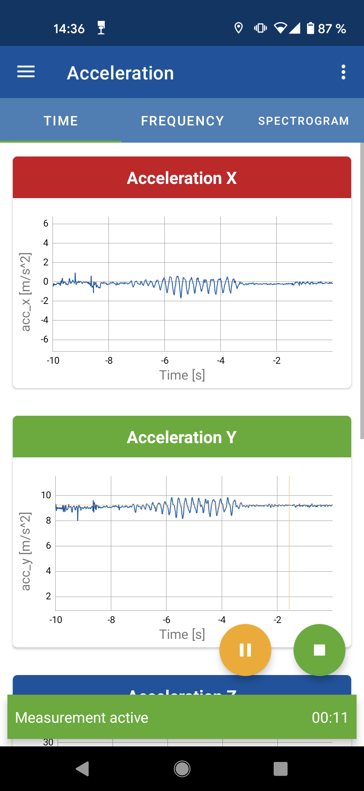

Ridy
====

Ridy Smart Sensing Platform
###########################

Industries
----------

Railways
^^^^^^^^

Other
^^^^^

Ridy Android App
################

   Screenshot showing the Ridy Android App

The Ridy Android App is an app to record the sensors built into Android device.

Currently the following sensors are supported:

* Accelerometer
* Uncalibrated Accelerometer
* Linear Accelerometer (Acceleration without g-Force)
* Uncalibrated Linear Accelerometer
* Magnetometer
* Uncalibrated Magnetometer
* Gyroscope
* Uncalibrated Gyrscope
* Orientation
* Rotation Vector
* Fused Location (based on GNSS + Cellular position)
* Raw GNSS measurements including GNSS clock measurements and NMEA messages
* Humidity
* Temperature
* Pressure
* Light Intensity

Note that some sensors might cannot be recorded on certain devices due to hard- or software limitations.
The Ridy Android App follows closely the functionality available in the Android SDK. 
The Documentation of the `Android SDK <https://developer.android.com/guide/topics/sensors/sensors_overview>`_ also holds
many more information on Android Sensors.

Transfering Data
----------------
Measurement data can be transfered into two ways:

USB
   If you connect an Android device to a computer, you can access the storage of the device using a file explorer.
   The measurement files are located under the following path: "<Your Device>\Internal shared storage\Android\data
   \com.ifs_der_rwth_aachen.ridy\files" 

Sharing
   Measurement data can also be shared directly from the app. Go the measurement view and long-press a measurement file
   of your choice or press the options button located on the right side of each measurement file. Then select the
   "Share" option and use one of the app of your choice to share a file directly.

Ridy Web
########
Ridy Web is a modern web application for user-friendly processing of
measurement data currently under development at the Chair and Institute for Rail Vehicles
and Transport Systems at RWTH Aachen University.

PyRidy Python Library
#####################